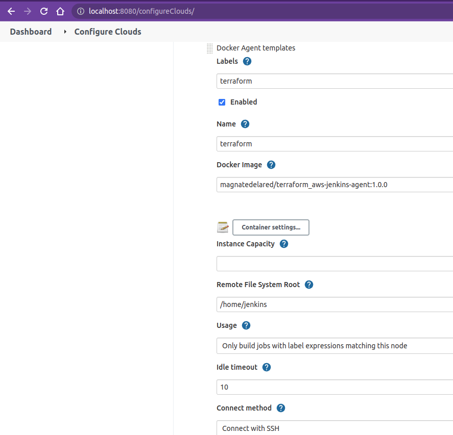
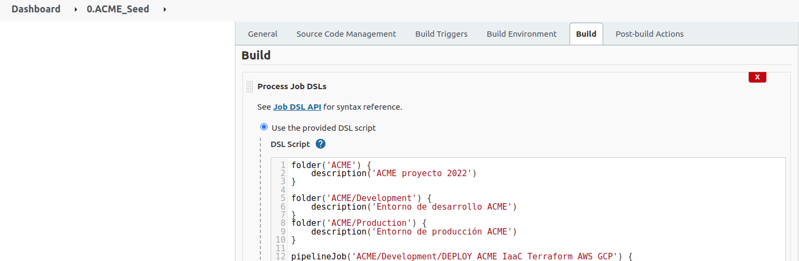

# KeepCoding DevOps-V CI/CD Práctica Final - David De la Cruz


## Flujo de despliegue de producción en el entorno Jenkins:
  
###  Requisitos:
 
Será necesario disponer de un **Servidor master de Jenkins**, para ello se pueden confeccionar las declaraciones de la **ejecución del servicio Jenkins** en un **fichero docker-compose** para que se levante un contenedor y ejecute el servidor master.

**`docker-compose.yml`**
  
```
version: '3.7'
services:
  jenkins:
    image: jenkins/jenkins:2.319.3-lts-jdk11
    ports:
      - 8080:8080
    container_name: jenkins
    volumes:
      - ./jenkins_home:/var/jenkins_home
      - /var/run/docker.sock:/var/run/docker.sock
      - /usr/bin/docker:/usr/bin/docker
```

<br>

Las **instrucciones para levantar el master de Jenkins** las puedes encontrar en este **[readme](https://github.com/KeepCodingCloudDevops5/cicd-jenkins#levantar-master-de-jenkins)**, propiedad de [Marta Arcones (QueerOps Engineer)](https://github.com/arcones).
  
Una vez levantado el servidor Jenkins, será necesario **configurar un servicio Cloud en Jenkins** (desde la UI), en este proyecto será un **servicio Cloud de Docker**, donde añadiremos la plantilla del agente a configurar:

```
1.- Instalar el plugin de Docker para Jenkins.

2.- Manage Jenkins → Manage nodes and clouds → Configure clouds → Docker → Docker Cloud Details

    Ejecuta ‘ifconfig’ en la shell y busca la dirección IP correspondiente a Docker:
      docker0: flags=4099<UP,BROADCAST,MULTICAST>  mtu 1500
        inet 172.17.0.1  netmask 255.255.0.0  broadcast 172.17.255.255
        
3.- Configurar el apartado Docker Host URI: 
      tcp://172.17.0.1:4243
      Habilitar el check de Enabled.

      Darle al botón 'test connection' y deberá de devolver la Versión del Docker Daemon y la versión del contrato con la API.
       Version = 20.10.14, API Version = 1.41

4.- Hacer click en el botón Docker Agent templates → Add Docker Template
     Labels: terraform
     Habilitar el check de Enabled.
     Name: terraform
     Docker Image: magnatedelared/terraform_aws-jenkins-agent:1.0.0
     Remote File System Root: /home/jenkins
     Usage: Seleccionar ‘Only build jobs with label expressions matching this node’
     Connect method: Connect with SSH
        SSH Key: Use configured SSH credentials
        Add → Jenkins
           Username: jenkins
           Password: jenkins
           ID: ssh-jenkins
           
        Seleccionar del desplegable las credenciales que acabamos de crear.
        
        En el desplegable de Host Key Verification Strategy, seleccionar: Non verifying Verification Strategy
     Pull Strategy: Pull all images every time ***(El inconveniente es que si no hay acceso a docker-hub, no podrá descargar la imagen)

```

<br>



<br>

 También será necesario **habilitar la API Remota de Docker**, para que el Master de Jenkins se pueda comunicar con el Docker Daemon:

```
Se habilita la API remota de docker modificando el fichero para que Jenkins pueda acceder en lugar de hacer un Bind:

Modificar el fichero:
    /usr/lib/systemd/system/docker.service
    
1.- Se comenta la línea:
      #ExecStart=/usr/bin/dockerd -H fd:// --containerd=/run/containerd/containerd.sock
      
2.- Se añade la línea:
      ExecStart=/usr/bin/dockerd -H tcp://0.0.0.0:4243 -H unix:///var/run/docker.sock
      
3.- Se reinicia el demonio:
      sudo systemctl daemon-reload

4.- Se reinicia el servicio docker:
      service docker restart

5.-  Se realiza una comprobación de conectividad:
       curl http://0.0.0.0:4243/version 2> /dev/null | jq
```

  
  
<br>
  
  Para crear el **agente "Terrafom-AWS" desde donde se llevará a cabo el levantamiento de la infraestructura de Terraform**, se hace uso de las declaraciones de un fichero Dockerfile que creará una **imagen docker** y que tendrá la **base** (Java, Maven y OpenSSH) **para que el Servidor de Jenkins se pueda conectar a él mediante SSH.**

  **Se declara un fichero Dockerfile**, que **partiendo de la imagen base**, **se instala** todo lo necesario para que funcione la aplicación de **Terraform y la CLI de AWS** (de manera similar a la cocción de la imagen correspondiente al despliegue en local), siendo ésta imagen la que **servirá de agente para Jenkins, ejecutando un contenedor de ésta imagen por parte del Master de Jenkins, y desde donde se llevará a cabo el despliegue.**

**jenkins-base.Dockerfile**

```
FROM ubuntu:20.04

ARG DEBIAN_FRONTEND=noninteractive

RUN apt-get update && \
    apt-get install -qy git wget software-properties-common openssh-server && \
    sed -i 's|session    required     pam_loginuid.so|session    optional     pam_loginuid.so|g' /etc/pam.d/sshd && \
    mkdir -p /var/run/sshd && \
    apt-get install -qy openjdk-8-jdk && \
    apt-get install -qy maven && \
    useradd -ms /bin/bash jenkins && \
    echo "jenkins:jenkins" | chpasswd && \
    mkdir /home/jenkins/.m2

RUN mkdir /home/jenkins/.ssh/ && \
    touch /home/jenkins/.ssh/authorized_keys

RUN chown -R jenkins:jenkins /home/jenkins/.m2/ && \
    chown -R jenkins:jenkins /home/jenkins/.ssh/

EXPOSE 22

CMD ["/usr/sbin/sshd", "-D"]
```

**terraform-aws.Dockerfile**
  
```
FROM magnatedelared/jenkins_base-agent:1.2.0

# Se hace uso de un argumento para definir el valor de la variable de entorno que permite no ser preguntado al 
#realizar un apt install.
ARG DEBIAN_FRONTEND=noninteractive
# Se define la variable que almacenará la versión de Terraform a instalar:
ARG TF_VERSION=1.1.7
# Se instala la paquetería necesaria para tener instalado Terraform y AWS-CLI:
COPY packages.txt .
RUN apt-get update && xargs -a packages.txt apt install -y && \ 
    curl -fsSL https://apt.releases.hashicorp.com/gpg | apt-key add - && \ 
    apt-add-repository "deb [arch=amd64] https://apt.releases.hashicorp.com $(lsb_release -cs) main" && \ 
    apt-get update && apt-get install terraform=${TF_VERSION} -y && \
    mkdir /home/jenkins/.aws/

EXPOSE 22

CMD ["/usr/sbin/sshd", "-D"]
```       
  
**Una vez declaradas las sentencias de los ficheros Dockerfile, será necesario crear las imágenes docker correspondientes y subirlas a Docker Hub para que el master de Jenkins pueda ejecutar un contenedor de ésta imagen que servirá de Agente para la ejecución de los stages declarados en los ficheros Jenkinsfile.**

`docker push magnatedelared/jenkins_base-agent:1.2.0`  
`docker push magnatedelared/terraform_aws-jenkins-agent:1.0.0`
  
<br>

**Desde la UI de Jenkins**, crearemos el **job 0.ACME_Seed que generará automáticamente 4 pipelineJob del proyecto ACME**, se crea un JobDSL (ayudándonos del **plugin "Job DSL" de Jenkins**) que creará 3 carpetas, para jerarquizar la estructura de los jobs de cada entorno.  

Además, en este JobDSL se crean 4 pipelineJob, **2 de estos corresponden al entorno de desarrollo (creados para pruebas por los desarrolladores y que realizan las mismas acciones que en el fichero makefile del entorno local)**, y los otros **2 corresponden al entorno de producción**.  

Cada pipelineJob tiene en su definición la **url del repositorio remoto** que **contiene el fichero de configuración Jenkinsfile** donde estarán definidos los diferentes stages del pipeline.  
Este repositorio **también contiene los ficheros de la infraestructura de Terraform** asociado al entorno que corresponda, y **que será clonado en el contenedor Docker del Agente definido.** También tiene definida la ruta al fichero Jenkinsfile de referencia.  

Las parejas de pipelineJob's de cada entorno, realizan la misma funcionalidad, que corresponden a:

1. apply
: Levantamiento de la infraestructura de Terraform.

2. destroy
: Destrucción de la infraestructura de Terraform.

<br>

**"JobDSL" correspondiente a los pipelines del Despliegue de los recursos de almacenamiento:**

```
folder('ACME') {
    description('ACME proyecto Cloud-2022')
}

folder('ACME/Development') {
    description('Entorno de desarrollo ACME')
}
folder('ACME/Production') {
    description('Entorno de producción ACME')
}

pipelineJob('ACME/Development/DEPLOY_ACME_IaaC_Terraform_AWS_GCP') {
    definition {
        cpsScm {
            scm {
                git {
                    remote {
                        url("https://github.com/davidjapo/acme-iaac-aws-gcp-dev--BIS.git")
                    }
                    branches("master")
                    scriptPath('Jobs_Jenkinsfiles/acme_iaac_dev_apply.Jenkinsfile')
                }
            }
        }
    }
}

pipelineJob('ACME/Development/DESTROY_ACME_IaaC_Terraform_AWS_GCP') {
    definition {
        cpsScm {
            scm {
                git {
                    remote {
                        url("https://github.com/davidjapo/acme-iaac-aws-gcp-dev--BIS.git")
                    }
                    branches("master")
                    scriptPath('Jobs_Jenkinsfiles/acme_iaac_dev_destroy.Jenkinsfile')
                }
            }
        }
    }
}
pipelineJob('ACME/Production/DEPLOY_ACME_IaaC_Terraform_AWS_GCP') {
    definition {
        cpsScm {
            scm {
                git {
                    remote {
                        url("https://github.com/davidjapo/acme-iaac-aws-gcp-prod--BIS.git")
                    }
                    branches("master")
                    scriptPath('Jobs_Jenkinsfiles/acme_iaac_prod_apply.Jenkinsfile')
                }
            }
        }
    }
}

pipelineJob('ACME/Production/DESTROY_ACME_IaaC_Terraform_AWS_GCP') {
    definition {
        cpsScm {
            scm {
                git {
                    remote {
                        url("https://github.com/davidjapo/acme-iaac-aws-gcp-prod--BIS.git")
                    }
                    branches("master")
                    scriptPath('Jobs_Jenkinsfiles/acme_iaac_prod_destroy.Jenkinsfile')
                }
            }
        }
    }
}
```



<br>

**acme\_iaac\_prod\_apply.Jenkinsfile** 

```
pipeline {
    agent {
        label('terraform')
    }
    environment {
        FILENAME_TFVARS_PROD  = "acme-prod.tfvars"
        AWS_ACCESS_KEY_ID     = credentials('acme-aws-secret-key')
        AWS_SECRET_ACCESS_KEY = credentials('acme-aws-secret-access-key')
        GOOGLE_APPLICATION_CREDENTIALS = credentials("Google-Credentials")
    }
    options { 
        disableConcurrentBuilds()
        timeout(time: 10, unit: 'MINUTES')
        timestamps()
    }    
    stages {
        stage('Terraform Init') {
            steps {
                sh 'terraform init'
            }
        }
        stage('Terraform Plan') {
            steps {
                sh 'terraform plan -var-file=$FILENAME_TFVARS_PROD'
            }
        }
        stage('Deploy Storage device') {
            steps {
                timeout(time: 10, unit: 'MINUTES') {
                    input message: 'Are you sure to DEPLOY?', ok: 'Yes, deploy the Storage device.'
                        sh 'terraform apply -var-file=$FILENAME_TFVARS_PROD --auto-approve'
                }
            }
        }
        stage('Buckets S3 almacenados') {
            steps {
                sh 'aws s3 ls'
            }
        }        
    }
}
```

En este fichero Jenkinsfile se está definiendo un pipeline de Terraform que será ejecutado en el **agente "terraform"**, cuyas credenciales correspondientes a los proveedores Cloud se encuentran en el almacén de credenciales de Jenkins, haciendo uso de la **opción "disableConcurrentBuild"** (para **evitar generar una condición de carrera**, es decir, escribir en el mismo recurso a la vez, evitando que dos pipelines corran a la vez, ya que si se le da a correr 2 veces el pipeline, el 2º se queda en espera).

La **opción timeout** es para que el pipeline a los 10 minutos se detenga para que Jenkins no se queda infinitamente esperando en el limbo...

La **opción timestamps** permite añadir la fecha/hora en los logs.

Finalmente **se definen** los **4 stage que compondrán el conjunto de acciones que corresponderá al despliegue de la IaaC en el entorno de producción** y que son los siguientes:  
  
1. **stage "Terraform Init"**
: En este stage se inicializa el directorio de trabajo que contiene los archivos de configuración de Terraform, de esta forma garantizamos que el estado de Terraform se encuentra en la condición de inicializado antes de realizar el despliegue deseado.

2. **stage "Terraform Plan"**
: Este stage se encarga de crear el plan de ejecución y determinar qué acciones son necesarias para lograr el estado deseado especificado en los archivos de configuración.

3. **stage "Deploy Storage device"**
: En este stage es donde se va a llevar a cabo el despliegue de la unidad de almacenamiento en ambos proveedores Cloud.

4. **stage "Buckets S3 almacenados"**
: En este stage se realiza una pequeña comprobación de los buckets S3 almacenados en AWS. La comprobación de los storage device de GCP no se lleva a cabo ya que no se ha implementado la instalación del SDK correspondiente.

<br>

En el fichero **acme\_iaac\_prod\_destroy.Jenkinsfile** se define un pipeline que es muy similar al fichero Jenkinsfile donde se lleva a cabo el despliegue de la unidad de almacenamiento, pero **en este fichero** en su lugar **se define el stage que se encargará de la destrucción de los recursos desplegados anteriormente** y cuyo bloque de código reza así:

```
stage('Destroy Storage device') {
    steps {
        timeout(time: 10, unit: 'MINUTES') {
                input message: 'Are you sure to destroy?', ok: 'Yes, destroy the Storage device.'
                sh 'terraform destroy -var-file=$FILENAME_TFVARS_PROD --auto-approve' 
        }
    }
}
```


<br>


  
<br>  
  
- Sin embargo, en el flujo de despliegue de **prod** hará falta que un administrador apruebe el despliegue:

  - En este caso, en el **fichero Jenkinsfile asociado al entorno de producción**, en el **stage "Deploy Storage device" se ha configurado un step con** un timeout de 10 minutos y dentro de este timeout se ha configurado **un input message, para que se le pregunte al usuario para aprobar el despliegue correspondiente**. Una vez aprobado el despliegue de forma manual (desde la UI de Jenkins), se comenzará a desplegar la IaaC, ya que se ha configurado la opción '--auto-approve' al realizar el apply de Terraform, para que Terraform no solicite escribir 'yes'
  


 <br>  
  
