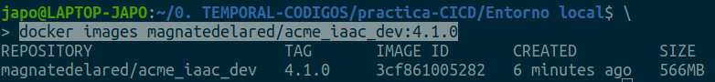
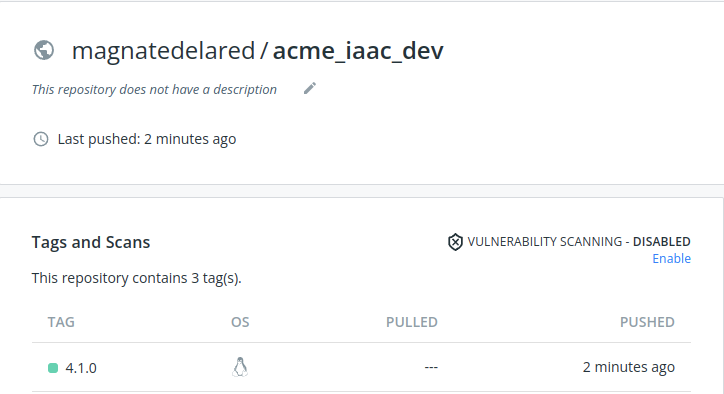
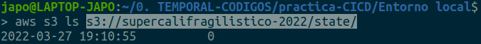
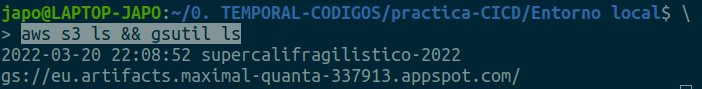
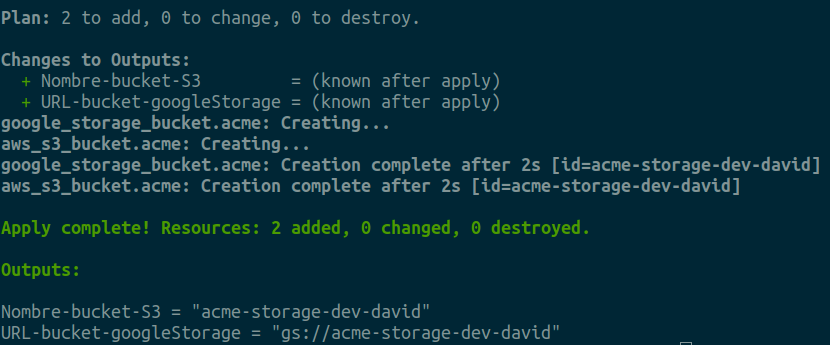
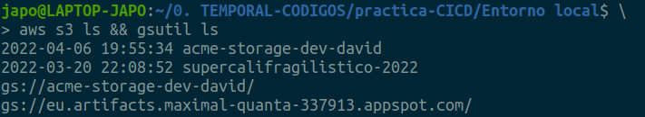
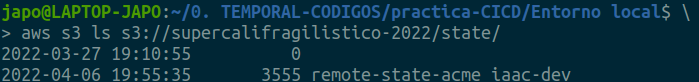
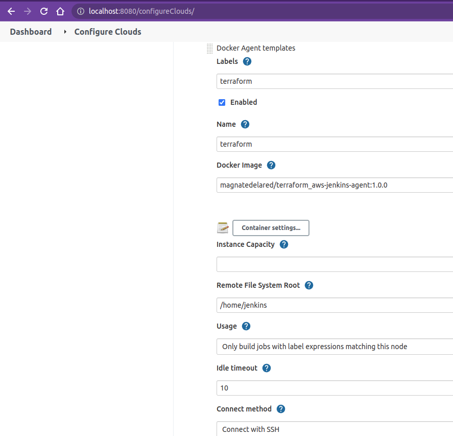
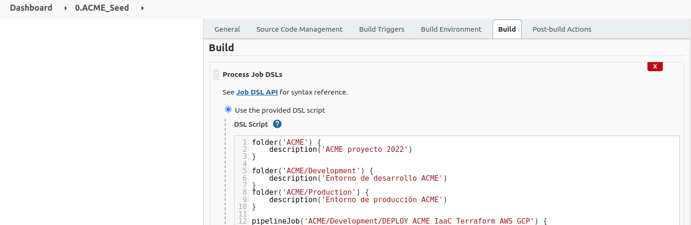

# KeepCoding DevOps-V CI/CD Práctica Final - David De la Cruz

La empresa ACME quiere empezar a probar la nube, por lo que vamos a **crear de manera totalmente automatizada** unidades de **almacenamiento en la nube (AWS S3, GCP Cloud Storage)** haciendo uso de la herramienta **Terraform** para la escritura de la IaaC de dichas nubes públicas.

Los requerimientos que nos ha dado ACME son los siguientes:

- Quieren **dos unidades de almacenamiento en cada cloud**, correspondiente a los entornos de desarrollo y producción, cuyos tags son:
	-	**acme-storage-dev**
	-	**acme-storage-prod**
	
	La infraestructura de Terraform quedaría de la siguiente manera:
	
**main.tf**
	
```
#El estado se almacena en un bucket S3 de ACME:
terraform {
  backend "s3" {
    bucket = "supercalifragilistico-2022"
    key    = "state/remote-state-acme_iaac-dev"
    region = "eu-west-1"
    shared_credentials_file = "$${HOME}/.aws/credentials"
  }
}
#Creación del recurso bucket S3 en AWS:
resource "aws_s3_bucket" "acme" {
  bucket = var.resource_name.s3
  tags = var.tags_resource_aws
}
#Creación del recurso bucket de cloud storage en GCP:
resource "google_storage_bucket" "acme" {
  name = var.resource_name.gs
  location = var.config_gcp.region
  labels = var.tags_resource_gcp
}
```

En este fichero **main.tf** se está declarando la infraestructura que tiene que manejar Terraform y que se detalla a continuación:   
 
 1. En el bloque de código correspondiente a **terraform{}** se está declarando que el **BackEnd de Terraform** se va a gestionar mediante un **bucket S3 en AWS** llamado **"supercalifragilistico-2022"** cuyo nombre correspondiente al fichero del estado de Terraform es **"remote-state-acme_iaac-dev"** dentro de la carpeta **"state"** de dicho bucket, ubicado en la región AWS de **"eu-west-1"** que corresponde a Irlanda.
  
    También se declara que el fichero de **credenciales de AWS** está ubicado en la **carpeta .aws del directorio personal del usuario**; necesario para que Terraform pueda acceder a la **lectura/escritura del estado de la infraestructura** y poder tenerlo a buen recaudo en cuanto a **seguridad** se refiere.  
Estos **valores** tienen que estar SI o SI **harcodeados en el código**, en lugar de utilizar referencias a variables, ya que así se expresa en la especificación del lenguaje de configuración de Terraform.

 2. En el bloque de código correspondiente a la creación del recurso  de un **bucket S3 en AWS**, se declara el **nombre que recibirá el bucket** así como los **tags** que acompañan a este recurso.

 3. En el bloque de código correspondiente a la creación del recurso **storage bucket en GCP**, se declara el **nombre que tendrá este bucket**, la **región** donde estará ubicado el bucket y los **tags** que acompañarán a este recurso.  

    Los valores de los argumentos son referencias a las **variables contenidas en el fichero variables.tf**

**providers.tf**

```
provider "aws" {
  shared_config_files	  = var.config_aws.shared_config_files
  shared_credentials_files = var.config_aws.shared_credentials_files
  profile = var.config_aws.profile
  region  = var.config_aws.region
}

provider "google" {
  project = var.config_gcp.project
  region  = var.config_gcp.region
  zone    = var.config_gcp.zone
}
```

En este fichero **providers.tf** se está declarando el proveedor que será necesario utilizar para el despliegue de la IaaC:  

  1. En el bloque de código correspondiente al **provider aws**, se está declarando donde están ubicados los archivos con la configuración personalizada de AWS y con las credenciales, así como también el nombre del perfil de configuración personalizada del que se hará uso por parte de AWS y la región donde se crearán los recursos de forma predeterminada.  
  2. En el bloque de código correspondiente al **provider google**, se está declarando el nombre del proyecto de GCP, así como también la región y la zona donde se crearán los recursos.    

     Los valores de los argumentos son referencias a las **variables contenidas en el fichero variables.tf**

**variables.tf**

```
# Configuración del proveedor AWS:
  description = "Propiedades pertenecientes a la configuración del proveedor de cloud 'AWS'."
  type = object({
    shared_config_files = list(string)
    shared_credentials_files = list(string)
    profile = string
    region  = string
  })
}

# Configuración del proveedor GCP:
variable "config_gcp" {
  description = "Propiedades pertenecientes a la configuración del proveedor de cloud 'GCP'."
  type = object({
    project = string
    region = string
    zone = string
  })
}

#Nombres de los recursos:
variable "resource_name" {
  description = "Almacenar el nombre de los recursos"
  type = map(string)
}

#Etiquetas de los recursos AWS:
variable "tags_resource_aws" {
  description = "Nombres que tendrán los tags de los recursos de AWS"
  type = map(string)
}

#Etiquetas de los recursos GCP:
variable "tags_resource_gcp" {
  description = "Nombres que tendrán los tags de los recursos en GCP"
  type = map(string)
}
```

En este fichero **variables.tf** se definen los **nombres de las variables** y el **tipo de dato a guardar en dicha variable** y que serán utilizadas por el resto de ficheros de configuración de Terraform, ayudando a la **centralización de los datos del proyecto** de la infraestructura.  

Los valores de estas variables estarán declarados en el **fichero personalizado para el entorno de desarrollo** del cliente ACME con nombre **acme-dev.tfvars**

**acme-dev.tfvars**

```
config_aws = {
    shared_config_files      = ["$${HOME}/.aws/config"]
    shared_credentials_files = ["$${HOME}/.aws/credentials"]
    profile = "default"
    region  = "eu-west-1"
}

config_gcp = {
  project = "maximal-quanta-337913"
  region = "europe-west3"
  zone = "europe-west3-b"
}

tags_resource_aws = {
    env = "dev"
    name = "Disco de almacenamiento de ACME - Development"
}

tags_resource_gcp = {
    "env" : "dev"
    "name": "disco_de_almacenamiento_de_acme_development"
}

resource_name = {
  "s3" = "acme-storage-dev-david"
  "gs" = "acme-storage-dev-david"
}
output = json
```

En este fichero **acme-dev.tfvars**` se declaran los valores personalizados que contendrán las variables correspondientes al fichero *variables.tf*, de esta forma todos los datos estarán centralizados en este fichero.    
 
*Los valores aquí expuestos no representan un riesgo de seguridad.*


**outputs.tf**

```
output "Nombre-bucket-S3" {
  value = aws_s3_bucket.acme.id
}


output "URL-bucket-googleStorage" {
  value = google_storage_bucket.acme.url
}
```

En este fichero **outputs.tf** se declaran los datos que debe de devolver tras el despliegue de la infraestructura.

**En este caso devolverá el nombre de los recursos que habrán quedado levantados** tras el deploy, que son el nombre del bucket S3 de AWS y el nombre del bucket storage de GCP.

<br>

- Los desarrolladores de ACME han de poder hacer el despliegue desde sus máquinas para el entorno de dev:

  Para que se pueda llevar a cabo el despliegue del entorno de desarrollo desde las máquinas de los desarrolladores, se ha cocinado una imagen docker, permitiendo de esta forma poder ejecutar un contenedor de ésta imagen, que ya tendrá todo lo necesario para poder ejecutar comandos de Terraform y de AWS CLI, y será desde desde este contenedor, aislado de las maquinas de los desarrolladores, desde donde se va a llevar a cabo el despliegue de los recursos de almacenamiento.
  
  La definición de la imagen docker queda registrada de la siguiente manera en un fichero:

**terraform_dev.Dockerfile**

```
FROM ubuntu:20.04

# Se hace uso de un argumento para definir el valor de la variable de entorno que permite no ser preguntado
# al realizar un apt install.
ARG DEBIAN_FRONTEND=noninteractive

# Se define un argumento que almacenará la versión de Terraform a instalar:
ARG TF_VERSION=1.1.7

# Se define la variable de entorno que almacenará la ruta del fichero de credenciales por defecto para GCP:
ENV GOOGLE_APPLICATION_CREDENTIALS=/root/.gcp/cred.json

# Se crea el directorio de trabajo y nos movemos a él:    
WORKDIR /app

# Se instala la paquetería necesaria para tener instalado Terraform y AWS-Cli:
COPY packages.txt .
RUN apt-get update && xargs -a packages.txt apt install -y && \ 
    curl -fsSL https://apt.releases.hashicorp.com/gpg | apt-key add - && \ 
    apt-add-repository "deb [arch=amd64] https://apt.releases.hashicorp.com $(lsb_release -cs) main" && \ 
    apt-get update && apt-get install terraform=${TF_VERSION} -y

# Clonamos el repositorio de git con la infraestructura de terraform del entorno de desarrollo:
ARG URL_REPO_GITHUB=https://github.com/davidjapo/acme-iaac-aws-gcp-dev--BIS.git
ARG NOMBRE_REPO_GITHUB=acme-iaac-aws-gcp-dev--BIS
RUN git clone ${URL_REPO_GITHUB}
WORKDIR ${NOMBRE_REPO_GITHUB}

# Se copia el script de ejecución del contenedor docker que creará la IaaC "Acme Dev":
COPY bootstrap.sh .
ENTRYPOINT ["./bootstrap.sh"]
CMD [""]
```

En este fichero **terraform_dev.Dockerfile** se parte de una imagen base de Ubuntu, al que se le instala la aplicación de Terraform y de AWS CLI para levantar la IaaC.

La paquetería necesaria esta definida en el fichero **packages.txt** haciendo mención a la versión de cada paquete a instalar, propiciando de esta forma una **buena práctica de trabajo al pinear la versión del paquete**, creando un ambiente consistente ayudando a evitar errores de utilización ante la actuación de estos por la aplicación. **¡¡OJO!!** Las versiones pineadas de los paquetes van acorde con la versión del sistema operativo instalado.

También se lleva a cabo la clonación de un repositorio de Github, correspondiente a la infraestructura de Terraform.  
En este caso al tratarse del entorno de desarrollo, el repositorio contendrá únicamente los ficheros de la infraestructura de desarrollo, y tal y como se observa en la definición del argumento **URL\_REPO\_GITHUB**,se está añadiendo un repositorio por defecto, de esta forma, la imagen ya tendrá todo lo necesario para poder llevar a cabo el despliegue, pero como la url de este repositorio se está guardando en un argumento del fichero Dockerfile, esto permite poder modificar en tiempo de compilación de la imagen, el valor de este argumento, permitiendo cocinar la imagen con un repositorio a demanda del desarrollador.

Al sistema de ficheros de esta imagen se le añade el fichero correspondiente al script de ejecución del despliegue y que está definida en la instrucción **ENTRYPOINT**.

Por defecto, la ejecución del contenedor como tal, no conlleva el levantamiento de la infraestructura, si no que hay que pasarle el argumento apropiado para ello, quedando sobreescrito el valor de cadena vacía de la instrucción **CMD**.

El argumento apropiado para el despliegue de la infraestructura lo podemos encontrar en el siguiente script de ejecución, y que contiene los comandos necesarios de Terraform para su ejecución:

**bootstrap.sh**

```
#!/bin/bash
# ESTE SCRIPT EJECUTARÁ LOS COMANDOS DE TERRAFORM NECESARIOS, PARA QUE TU PUEDAS ABSTRAERTE DE ELLO :-D

#Se definen los nombres de los ficheros que contienen los valores correspondientes a la variables declaradas
#en el fichero variables.tf y que servirán para discriminar el tipo de entorno a desplegar:
FILENAME_TFVARS_DEV='acme-dev.tfvars'
FILENAME_TFVARS_PROD='acme-prod.tfvars'

#Funciones para el entorno de desarrollo:
function dev.apply() {
    terraform init
    terraform apply -var-file=$FILENAME_TFVARS_DEV -auto-approve
}
function dev.plan() {
    terraform init
    terraform plan -var-file=$FILENAME_TFVARS_DEV    
}
function dev.destroy() {
    terraform init
    terraform destroy -var-file=$FILENAME_TFVARS_DEV    
}


#Funciones para el entorno de producción:
function prod.apply() {
    terraform init
    terraform apply -var-file=$FILENAME_TFVARS_PROD
}
function prod.plan() {
    terraform init
    terraform plan -var-file=$FILENAME_TFVARS_PROD    
}
function prod.destroy() {
    terraform init
    terraform destroy -var-file=$FILENAME_TFVARS_PROD    
}


# Se define la sentencia de control que se usará para la utilización del script, en función del argumento que se le
# pase y que llamará a las funciones que correspondan según el argumento:
if [ -z $1 ]; then
  echo ""
  echo "No se ha ejecutado el script porque no se le ha pasado el argumento requerido..."  
  echo ""
  echo "Argumento dev.plan --> Para comprobar el planning de la infraestructura a levantar en el entorno de desarrollo."
  echo "Argumento dev.apply --> Para levantar la infraestructura requerida en el entorno de desarrollo."
  echo "Argumento dev.destroy --> Para destruir la insfraestructura levantada en el entorno de desarrollo (necesita confirmación del usuario)."
  echo ""
  echo "Argumento prod.plan --> Para comprobar el planning de la infraestructura a levantar en el entorno de producción."
  echo "Argumento prod.apply --> Para levantar la infraestructura requerida en el entorno de producción (necesita confirmación del usuario)."
  echo "Argumento prod.destroy --> Para destruir la insfraestructura levantada en el entorno de producción (necesita confirmación del usuario)."
  echo ""
elif [ $1 == dev.plan ]; then
  dev.plan
elif [ $1 == dev.apply ]; then
  dev.apply
elif [ $1 == dev.destroy ]; then
  dev.destroy
elif [ $1 == prod.plan ]; then
  prod.plan
elif [ $1 == prod.apply ]; then
 prod.apply
elif [ $1 == prod.destroy ]; then
  prod.destroy
fi

exit 0
```

En este fichero **bootstrap.sh** se definen las funciones que ejecutarán los comandos de Terraform correspondientes al despliegue de ambas infraestructuras (dev&prod), funciones que serán llamadas dependiendo del argumento que se le pase en la ejecución de este script bash, y que corresponderán con las 3 acciones que realizará Terraform sobre la infraestructura:

 1. plan
: Muestra los cambios requeridos para la configuración de la infraestructura declarada.

 2. apply
: Crea o actualiza la infraestructura.

 3. destroy
: Destruye la infraestructura declarada anteriormente.

En el caso de que al script no le se pasara ningún argumento, la acción del despliegue será nulo.

<br>  

- Quieren que el flujo de despliegue para el entorno de dev sea totalmente automático, sin intervención manual:

  Para llevar a cabo el flujo de despliegue automatizado en el entorno de desarrollo, se ha propuesto llevarlo a cabo mediante MAKE, por lo que se ha elaborado un fichero makefile que contiene los stages correspondientes al despliegue.  
  
  **Los stages declarados** en el siguiente fichero son considerados **IDEMPOTENTES**, ya que **en cada nueva ejecución se producen los mismos resultados**, pudiendo ser repetidos tantas veces como sean necesarios sin causar efectos involuntarios: 

  
**makefile-dev**

```
# Se almacena la ruta relativa donde se ubican los ficheros correspondientes a la infraestructura de desarrollo:
PATH_INFRA_DEV = infra/dev
# Se almacenan las rutas absolutas de los directorios donde se ubican los ficheros correspondientes a las credenciales
#de AWS y GCP:
PATH_CREDENTIALS_AWS = /home/japo/.aws
PATH_CREDENTIALS_GCP = /home/japo/.gcp
# Se define el nombre y tag que tendrá la imagen cocinada:
NAME_DOCKER = magnatedelared/acme_iaac_dev:4.0.0
# Se asigna el nombre del fichero correspondiente a la definción de la imagen a cocinar:
NAME_DOCKERFILE = terraform_dev.Dockerfile
# Se declara el nº de la versión correspondiente a la aplicación Terraform:
TF_VERSION = 1.1.7
# Se guarda la url correspondiente al repositorio de Github a clonar y que contendrá la infraestructura a levantar:
URL_REPO_GITHUB = https://github.com/davidjapo/acme-iaac-aws-gcp-dev--BIS.git
NOMBRE_REPO_GITHUB = acme-iaac-aws-gcp-dev--BIS


# El stage all permite ejecutar de forma secuencial los stages definidos en él mismo. 
# Si algo no funciona, revisa que el stage esté referenciado en all.
all: clean dockerize push integration_test

# Realiza una limpieza para crear el pipeline sin suciedad, eliminando aquellos directorios
# de cachés y temporales varios, además de eliminar la imagen creada en otras ocasiones:
clean:
	@echo ***CLEAN STEP***  ***THIS IS AN OLD STEP***
	cd $(PATH_INFRA_DEV) && rm -rf .terraform .terraform.lock.hcl && docker rmi --force $(NAME_DOCKER) 2> /dev/null

# Se realiza la creación de una imagen Docker para posteriormente ejecutar un contenedor que arranque la App.
# Permite modificar en tiempo de compilación de la imagen, el valor de la variable de entorno donde se ubica el nombre
# del directorio de la infraestructura de Terraform, además de modificar el valor del argumento que almacena la url del repositorio a clonar:
dockerize:
	@echo ***BUILD IMAGE WITH CUSTOMIZE GITHUB REPOSITORY PATH STEP***
	cd docker && \
	docker build -f $(NAME_DOCKERFILE) -t $(NAME_DOCKER) \
	--build-arg URL_REPO_GITHUB=$(URL_REPO_GITHUB) \
	--build-arg NOMBRE_REPO_GITHUB=$(NOMBRE_REPO_GITHUB) .

# Permite modificar en tiempo de compilación de la imagen, el valor del argumento que almacena la versión de Terraform a instalar:
build-tf:
	@echo ***BUILD IMAGE WITH CUSTOMIZE TERRAFORM VERSION STEP***
	cd docker && \
	docker build -f $(NAME_DOCKERFILE) -t $(NAME_DOCKER) \
	--build-arg TF_VERSION=$(TF_VERSION) \
	--build-arg URL_REPO_GITHUB=$(URL_REPO_GITHUB) \
	--build-arg NOMBRE_REPO_GITHUB=$(NOMBRE_REPO_GITHUB) .

# Una vez creada la imagen Docker, se procede a subirla al repositorio del registro canónico de Docker 'Docker Hub'
# Este paso requerirá de credenciales para DockerHub.
push:
	@echo ***PUSH TO DOCKER-HUB STEP***
	docker push $(NAME_DOCKER)

# Se realiza el test de integración, que consiste en eliminar en local la imagen de docker creada anteriormente y
# ejecutar la creación de un contenedor, forzando así la descarga de la imagen desde el registro canónico de Docker.
# Se le pasa un volúmen que contiene las credenciales de AWS y que será montado en el contenedor para uso de Terraform.
# Este paso ejecutará la creación de la infraestructura de Terraform definida, al aplicar un apply en el entorno de
# desarrollo, por lo que es una acción intrusiva.
integration_test:
	@echo ***INTEGRATION TEST DEVELOPMENT ENVIRONMENT STEP***
	docker rmi --force $(NAME_DOCKER) 2> /dev/null && \
	docker run -i --rm -v $(PATH_CREDENTIALS_AWS):/root/.aws \
	-v $(PATH_CREDENTIALS_GCP):/root/.gcp $(NAME_DOCKER) dev.apply


# Se puede consultar el planning de la infraestructura. ¡ATENCION! Este paso no es intrusivo.
# Se comprueba el estado de la infraestructura que se almacena en un bucket S3 de ACME:
plan:
	@echo ***PLANNING IaaC STEP***
	docker rmi --force $(NAME_DOCKER) 2> /dev/null && \
	docker run --rm -v $(PATH_CREDENTIALS_AWS):/root/.aws \
	-v $(PATH_CREDENTIALS_GCP):/root/.gcp $(NAME_DOCKER) dev.plan

# Se puede modificar en tiempo de ejecución del contenedor, el valor de la variable de entorno donde se almacena la ruta
# al archivo de credenciales de GCP:
apply-custom-gcp:
	@echo ***APPLY IaaC WITH CUSTOMIZE GOOGLE ENVIRONMENT VARIABLE STEP***
	docker rmi --force $(NAME_DOCKER) 2> /dev/null && \
	docker run -i --rm -v $(PATH_CREDENTIALS_AWS):/root/.aws \
	-v $(PATH_CREDENTIALS_GCP):/root/.gcp_2022 \
	--env GOOGLE_APPLICATION_CREDENTIALS=/root/.gcp_2022/cred.json $(NAME_DOCKER) dev.apply

#Se destruye la infraestructura creada en el target integration_test:
destroy:
	@echo ***DESTROY IaaC STEP***
	docker rmi --force $(NAME_DOCKER) 2> /dev/null && \
	docker run -i --rm -v $(PATH_CREDENTIALS_AWS):/root/.aws \
	-v $(PATH_CREDENTIALS_GCP):/root/.gcp $(NAME_DOCKER) dev.destroy


# Se accederá al contenedor partiendo de la imagen creada en pasos anteriores, para testing:
access:
	@echo ***ACCESS TO CONTAINER STEP***
	docker run --rm -v $(PATH_CREDENTIALS_AWS):/root/.aws \
	-v $(PATH_CREDENTIALS_GCP):/root/.gcp \
	-it --entrypoint="bash" $(NAME_DOCKER)
```

En este fichero **makefile-dev** se define un primer bloque correspondiente a las variables que se van a utilizar dentro de este archivo, permitiendo centralizar los datos en una única área, referenciando a la variable necesaria en la definición del comando a ejecutar, siguiendo de ésta forma, buenas prácticas a la hora de trabajar.

Se han definido 10 stages, incluido el **stage "all"** que **permite la ejecución secuencial de diferentes stages correspondiente al levantamiento de la infraestructura.**  
Algunos stages se han creado pensando en un sistema escalable y customizable en el tiempo, como por ejemplo el **stage "build-tf"**, que **permite cocinar la imagen docker con una versión de Terraform personalizada por el usuario.**

Para que no exista intervención manual a la hora de desplegar el entorno de desarrollo, y de esta forma hacer que el despliegue sea totalmente automático para los desarrolladores, en el **stage "integration_test"**, que se encarga de la ejecución del contenedor docker, se le pasa el argumento **dev.apply** que se encargará de llamar a la función con mismo nombre del script **bootstrap.sh**, llevando a cabo el levantamiento de la infraestructura, y por consiguiente, la creación de los dispositivos de almacenamiento en ambas nubes.  
Para no ser preguntado por la confirmación del levantamiento de la IaaC por parte de Terraform, se hace uso de la opción **"-auto-approve"** que llevará a cabo la **aprobación de manera automática.**  
  
En el **stage "destroy" NO se hace uso de la opción -auto-approve**, no queremos una destrucción de infraestructura de manera no controlada y accidental :-)

<br>

### Una vez explicado todo lo anterior, se hace aporte de capturas de pantalla con la comprobación de las etapas del proyecto:

1. Se realiza la ejecución del **stage "dockerize"** que **se encarga de cocinar una imagen docker que contendrá todo lo necesario para poder realizar el despliegue:**  
  
  **`make -f makefile-dev dockerize`**

    
  
2. Se ejecuta el **stage "push"** para subir la imagen al Registry de imágenes canónico de Docker (Docker hub):

  **`make -f makefile-dev push`**
  
    

3. Se levanta la infraestructura requerida al ejecutar el **stage "integration_test"**, comprobando antes que no existen los recursos a levantar y que no existe aún el fichero de estado de Terraform en el bucket S3 configurado:

  **Se comprueba que en el bucket S3 asignado para almacenar el estado de Terraform, no se encuentra ningún fichero todavía:**
  
  

  **Se comprueba que no existen los recursos a desplegar en ningún proveedor cloud:**
  
  

  **Se ejecuta el despliegue de la IaaC:**

  **`make -f makefile-dev integration_test`** 
  
  

  **Se comprueba que los recursos desplegados existen:**
  
  

  **Se comprueba que el fichero de estado de Terraform a sido creado en el bucket S3 configurado para ello:**
  
  
  
<br>

- Quieren que las credenciales para desplegar nunca estén guardadas en el código:

  - En el caso del despliegue en local, las credenciales se encuentran en la máquina local del desarrollador.  
  Al ejecutar el **stage "integration_test"**, **se ejecuta el contenedor docker que se encargará de realizar el despliegue**, pero en las **opciones de ejecución** de este contenedor, se le pasa la **opción -v** junto **con las rutas absolutas de los directorios donde se ubican los ficheros correspondientes a las credenciales de AWS y GCP, para realizar un "Bind mount"**, de tal forma, que **las credenciales no quedan almacenadas en ninguna imagen, ni en ningún código**, tan solo habrá referencias a la ruta donde se ubican dichas credenciales.
  
  - En el caso del despliegue mediante los Pipeline de Jenkins, **se almacenan las credenciales necesarias en el gestor de credenciales de Jenkins**, y para hacer uso de ellas, en el fichero Jenkinsfile se crean 3 variables de entorno y nos ayudamos de la función "credentials()" de Terraform.
 
      

  Cabe mencionar en este momento, que **la infraestructura de los archivos de Terraform en el entorno de producción, difiere ligeramente con respecto al del entorno de desarrollo**, concretamente en la **configuración correspondiente a las credenciales de los proveedores de Cloud**, y esto es debido a que en el entorno de Jenkins para producción, las credenciales se almacenan en el almacén de Jenkins, por lo que **hay que comentar** las **líneas de código** en los siguientes ficheros.  
   **¡OJO!** tener cuidado con no sobre-escribir los ficheros correspondientes al entorno local.
  
**`infra/prod/providers.tf`**
  
```
provider "aws" {
  #shared_config_files      = var.config_aws.shared_config_files
  #shared_credentials_files = var.config_aws.shared_credentials_files
  #profile = var.config_aws.profile
}
``` 

<br>

**`infra/prod/variables.tf`**

```
# Configuración del proveedor AWS:
variable "config_aws" {
  description = "Propiedades pertenecientes a la configuración del proveedor de cloud 'AWS'."
  type = object({
    #shared_config_files = list(string)
    #shared_credentials_files = list(string)
    #profile = string
  })
}
```

<br>

**`infra/prod/acme-prod.tfvars`**

```
config_aws = {
    #shared_config_files      = ["$${HOME}/.aws/config"]
    #shared_credentials_files = ["$${HOME}/.aws/credentials"]
    #profile = "default"
}
```


<br>

## Flujo de despliegue de producción en el entorno Jenkins:
  
###  Requisitos:
 
Será necesario disponer de un **Servidor master de Jenkins**, para ello se pueden confeccionar las declaraciones de la **ejecución del servicio Jenkins** en un **fichero docker-compose** para que se levante un contenedor y ejecute el servidor master.

**`docker-compose.yml`**
  
```
version: '3.7'
services:
  jenkins:
    image: jenkins/jenkins:2.319.3-lts-jdk11
    ports:
      - 8080:8080
    container_name: jenkins
    volumes:
      - ./jenkins_home:/var/jenkins_home
      - /var/run/docker.sock:/var/run/docker.sock
      - /usr/bin/docker:/usr/bin/docker
```

<br>

Las **instrucciones para levantar el master de Jenkins** las puedes encontrar en este **[readme](https://github.com/KeepCodingCloudDevops5/cicd-jenkins#levantar-master-de-jenkins)**, propiedad de [Marta Arcones (QueerOps Engineer)](https://github.com/arcones).
  
Una vez levantado el servidor Jenkins, será necesario **configurar un servicio Cloud en Jenkins** (desde la UI), en este proyecto será un **servicio Cloud de Docker**, donde añadiremos la plantilla del agente a configurar:

```
1.- Instalar el plugin de Docker para Jenkins.

2.- Manage Jenkins → Manage nodes and clouds → Configure clouds → Docker → Docker Cloud Details

    Ejecuta ‘ifconfig’ en la shell y busca la dirección IP correspondiente a Docker:
      docker0: flags=4099<UP,BROADCAST,MULTICAST>  mtu 1500
        inet 172.17.0.1  netmask 255.255.0.0  broadcast 172.17.255.255
        
3.- Configurar el apartado Docker Host URI: 
      tcp://172.17.0.1:4243
      Habilitar el check de Enabled.

      Darle al botón 'test connection' y deberá de devolver la Versión del Docker Daemon y la versión del contrato con la API.
       Version = 20.10.14, API Version = 1.41

4.- Hacer click en el botón Docker Agent templates → Add Docker Template
     Labels: terraform
     Habilitar el check de Enabled.
     Name: terraform
     Docker Image: magnatedelared/terraform_aws-jenkins-agent:1.0.0
     Remote File System Root: /home/jenkins
     Usage: Seleccionar ‘Only build jobs with label expressions matching this node’
     Connect method: Connect with SSH
        SSH Key: Use configured SSH credentials
        Add → Jenkins
           Username: jenkins
           Password: jenkins
           ID: ssh-jenkins
           
        Seleccionar del desplegable las credenciales que acabamos de crear.
        
        En el desplegable de Host Key Verification Strategy, seleccionar: Non verifying Verification Strategy
     Pull Strategy: Pull all images every time ***(El inconveniente es que si no hay acceso a docker-hub, no podrá descargar la imagen)

```

<br>



<br>

 También será necesario **habilitar la API Remota de Docker**, para que el Master de Jenkins se pueda comunicar con el Docker Daemon:

```
Se habilita la API remota de docker modificando el fichero para que Jenkins pueda acceder en lugar de hacer un Bind:

Modificar el fichero:
    /usr/lib/systemd/system/docker.service
    
1.- Se comenta la línea:
      #ExecStart=/usr/bin/dockerd -H fd:// --containerd=/run/containerd/containerd.sock
      
2.- Se añade la línea:
      ExecStart=/usr/bin/dockerd -H tcp://0.0.0.0:4243 -H unix:///var/run/docker.sock
      
3.- Se reinicia el demonio:
      sudo systemctl daemon-reload

4.- Se reinicia el servicio docker:
      service docker restart

5.-  Se realiza una comprobación de conectividad:
       curl http://0.0.0.0:4243/version 2> /dev/null | jq
```

  
  
<br>
  
  Para crear el **agente "Terrafom-AWS" desde donde se llevará a cabo el levantamiento de la infraestructura de Terraform**, se hace uso de las declaraciones de un fichero Dockerfile que creará una **imagen docker** y que tendrá la **base** (Java, Maven y OpenSSH) **para que el Servidor de Jenkins se pueda conectar a él mediante SSH.**

  **Se declara un fichero Dockerfile**, que **partiendo de la imagen base**, **se instala** todo lo necesario para que funcione la aplicación de **Terraform y la CLI de AWS** (de manera similar a la cocción de la imagen correspondiente al despliegue en local), siendo ésta imagen la que **servirá de agente para Jenkins, ejecutando un contenedor de ésta imagen por parte del Master de Jenkins, y desde donde se llevará a cabo el despliegue.**

**jenkins-base.Dockerfile**

```
FROM ubuntu:20.04

ARG DEBIAN_FRONTEND=noninteractive

RUN apt-get update && \
    apt-get install -qy git wget software-properties-common openssh-server && \
    sed -i 's|session    required     pam_loginuid.so|session    optional     pam_loginuid.so|g' /etc/pam.d/sshd && \
    mkdir -p /var/run/sshd && \
    apt-get install -qy openjdk-8-jdk && \
    apt-get install -qy maven && \
    useradd -ms /bin/bash jenkins && \
    echo "jenkins:jenkins" | chpasswd && \
    mkdir /home/jenkins/.m2

RUN mkdir /home/jenkins/.ssh/ && \
    touch /home/jenkins/.ssh/authorized_keys

RUN chown -R jenkins:jenkins /home/jenkins/.m2/ && \
    chown -R jenkins:jenkins /home/jenkins/.ssh/

EXPOSE 22

CMD ["/usr/sbin/sshd", "-D"]
```

**terraform-aws.Dockerfile**
  
```
FROM magnatedelared/jenkins_base-agent:1.2.0

# Se hace uso de un argumento para definir el valor de la variable de entorno que permite no ser preguntado al 
#realizar un apt install.
ARG DEBIAN_FRONTEND=noninteractive
# Se define la variable que almacenará la versión de Terraform a instalar:
ARG TF_VERSION=1.1.7
# Se instala la paquetería necesaria para tener instalado Terraform y AWS-CLI:
COPY packages.txt .
RUN apt-get update && xargs -a packages.txt apt install -y && \ 
    curl -fsSL https://apt.releases.hashicorp.com/gpg | apt-key add - && \ 
    apt-add-repository "deb [arch=amd64] https://apt.releases.hashicorp.com $(lsb_release -cs) main" && \ 
    apt-get update && apt-get install terraform=${TF_VERSION} -y && \
    mkdir /home/jenkins/.aws/

EXPOSE 22

CMD ["/usr/sbin/sshd", "-D"]
```       
  
**Una vez declaradas las sentencias de los ficheros Dockerfile, será necesario crear las imágenes docker correspondientes y subirlas a Docker Hub para que el master de Jenkins pueda ejecutar un contenedor de ésta imagen que servirá de Agente para la ejecución de los stages declarados en los ficheros Jenkinsfile.**

`docker push magnatedelared/jenkins_base-agent:1.2.0`  
`docker push magnatedelared/terraform_aws-jenkins-agent:1.0.0`
  
<br>

**Desde la UI de Jenkins**, crearemos el **job 0.ACME_Seed que generará automáticamente 4 pipelineJob del proyecto ACME**, se crea un JobDSL (ayudándonos del **plugin "Job DSL" de Jenkins**) que creará 3 carpetas, para jerarquizar la estructura de los jobs de cada entorno.  

Además, en este JobDSL se crean 4 pipelineJob, **2 de estos corresponden al entorno de desarrollo (creados para pruebas por los desarrolladores y que realizan las mismas acciones que en el fichero makefile del entorno local)**, y los otros **2 corresponden al entorno de producción**.  

Cada pipelineJob tiene en su definición la **url del repositorio remoto** que **contiene el fichero de configuración Jenkinsfile** donde estarán definidos los diferentes stages del pipeline.  
Este repositorio **también contiene los ficheros de la infraestructura de Terraform** asociado al entorno que corresponda, y **que será clonado en el contenedor Docker del Agente definido.** También tiene definida la ruta al fichero Jenkinsfile de referencia.  

Las parejas de pipelineJob's de cada entorno, realizan la misma funcionalidad, que corresponden a:

1. apply
: Levantamiento de la infraestructura de Terraform.

2. destroy
: Destrucción de la infraestructura de Terraform.

<br>

**"JobDSL" correspondiente a los pipelines del Despliegue de los recursos de almacenamiento:**

```
folder('ACME') {
    description('ACME proyecto Cloud-2022')
}

folder('ACME/Development') {
    description('Entorno de desarrollo ACME')
}
folder('ACME/Production') {
    description('Entorno de producción ACME')
}

pipelineJob('ACME/Development/DEPLOY_ACME_IaaC_Terraform_AWS_GCP') {
    definition {
        cpsScm {
            scm {
                git {
                    remote {
                        url("https://github.com/davidjapo/acme-iaac-aws-gcp-dev--BIS.git")
                    }
                    branches("master")
                    scriptPath('Jobs_Jenkinsfiles/acme_iaac_dev_apply.Jenkinsfile')
                }
            }
        }
    }
}

pipelineJob('ACME/Development/DESTROY_ACME_IaaC_Terraform_AWS_GCP') {
    definition {
        cpsScm {
            scm {
                git {
                    remote {
                        url("https://github.com/davidjapo/acme-iaac-aws-gcp-dev--BIS.git")
                    }
                    branches("master")
                    scriptPath('Jobs_Jenkinsfiles/acme_iaac_dev_destroy.Jenkinsfile')
                }
            }
        }
    }
}
pipelineJob('ACME/Production/DEPLOY_ACME_IaaC_Terraform_AWS_GCP') {
    definition {
        cpsScm {
            scm {
                git {
                    remote {
                        url("https://github.com/davidjapo/acme-iaac-aws-gcp-prod--BIS.git")
                    }
                    branches("master")
                    scriptPath('Jobs_Jenkinsfiles/acme_iaac_prod_apply.Jenkinsfile')
                }
            }
        }
    }
}

pipelineJob('ACME/Production/DESTROY_ACME_IaaC_Terraform_AWS_GCP') {
    definition {
        cpsScm {
            scm {
                git {
                    remote {
                        url("https://github.com/davidjapo/acme-iaac-aws-gcp-prod--BIS.git")
                    }
                    branches("master")
                    scriptPath('Jobs_Jenkinsfiles/acme_iaac_prod_destroy.Jenkinsfile')
                }
            }
        }
    }
}
```



<br>

**acme\_iaac\_prod\_apply.Jenkinsfile** 

```
pipeline {
    agent {
        label('terraform')
    }
    environment {
        FILENAME_TFVARS_PROD  = "acme-prod.tfvars"
        AWS_ACCESS_KEY_ID     = credentials('acme-aws-secret-key')
        AWS_SECRET_ACCESS_KEY = credentials('acme-aws-secret-access-key')
        GOOGLE_APPLICATION_CREDENTIALS = credentials("Google-Credentials")
    }
    options { 
        disableConcurrentBuilds()
        timeout(time: 10, unit: 'MINUTES')
        timestamps()
    }    
    stages {
        stage('Terraform Init') {
            steps {
                sh 'terraform init'
            }
        }
        stage('Terraform Plan') {
            steps {
                sh 'terraform plan -var-file=$FILENAME_TFVARS_PROD'
            }
        }
        stage('Deploy Storage device') {
            steps {
                timeout(time: 10, unit: 'MINUTES') {
                    input message: 'Are you sure to DEPLOY?', ok: 'Yes, deploy the Storage device.'
                        sh 'terraform apply -var-file=$FILENAME_TFVARS_PROD'
                }
            }
        }
        stage('Buckets S3 almacenados') {
            steps {
                sh 'aws s3 ls'
            }
        }        
    }
}
```

En este fichero Jenkinsfile se está definiendo un pipeline de Terraform que será ejecutado en el **agente "terraform"**, cuyas credenciales correspondientes a los proveedores Cloud se encuentran en el almacén de credenciales de Jenkins, haciendo uso de la **opción "disableConcurrentBuild"** (para **evitar generar una condición de carrera**, es decir, escribir en el mismo recurso a la vez, evitando que dos pipelines corran a la vez, ya que si se le da a correr 2 veces el pipeline, el 2º se queda en espera).

La **opción timeout** es para que el pipeline a los 10 minutos se detenga para que Jenkins no se queda infinitamente esperando en el limbo...

La **opción timestamps** permite añadir la fecha/hora en los logs.

Finalmente **se definen** los **4 stage que compondrán el conjunto de acciones que corresponderá al despliegue de la IaaC en el entorno de producción** y que son los siguientes:  
  
1. **stage "Terraform Init"**
: En este stage se inicializa el directorio de trabajo que contiene los archivos de configuración de Terraform, de esta forma garantizamos que el estado de Terraform se encuentra en la condición de inicializado antes de realizar el despliegue deseado.

2. **stage "Terraform Plan"**
: Este stage se encarga de crear el plan de ejecución y determinar qué acciones son necesarias para lograr el estado deseado especificado en los archivos de configuración.

3. **stage "Deploy Storage device"**
: En este stage es donde se va a llevar a cabo el despliegue de la unidad de almacenamiento en ambos proveedores Cloud.

4. **stage "Buckets S3 almacenados"**
: En este stage se realiza una pequeña comprobación de los buckets S3 almacenados en AWS. La comprobación de los storage device de GCP no se lleva a cabo ya que no se ha implementado la instalación del SDK correspondiente.

<br>

En el fichero **acme\_iaac\_prod\_destroy.Jenkinsfile** se define un pipeline que es muy similar al fichero Jenkinsfile donde se lleva a cabo el despliegue de la unidad de almacenamiento, pero **en este fichero** en su lugar **se define el stage que se encargará de la destrucción de los recursos desplegados anteriormente** y cuyo bloque de código reza así:

```
stage('Destroy Storage device') {
    steps {
        timeout(time: 10, unit: 'MINUTES') {
                input message: 'Are you sure to destroy?', ok: 'Yes, destroy the Storage device.'
                sh 'terraform destroy -var-file=$FILENAME_TFVARS_PROD' 
        }
    }
}
```


<br>


  
<br>  
  
- Sin embargo, en el flujo de despliegue de **prod** hará falta que un administrador apruebe el despliegue:

  - En este caso, en el **fichero Jenkinsfile asociado al entorno de producción**, en el **stage "Deploy Storage device" se ha configurado un step con** un timeout de 10 minutos y dentro de este timeout se ha configurado **un input message, para que se le pregunte al usuario para aprobar el despliegue correspondiente**. Una vez aprobado el despliegue de forma manual, se comenzará a desplegar la IaaC.
  
  ¡PONER CAPTURAS DE LOS PIPELINE DE JENKINS CON LA COMPROBACIÓN DE LA APROBACION!

  <br>
